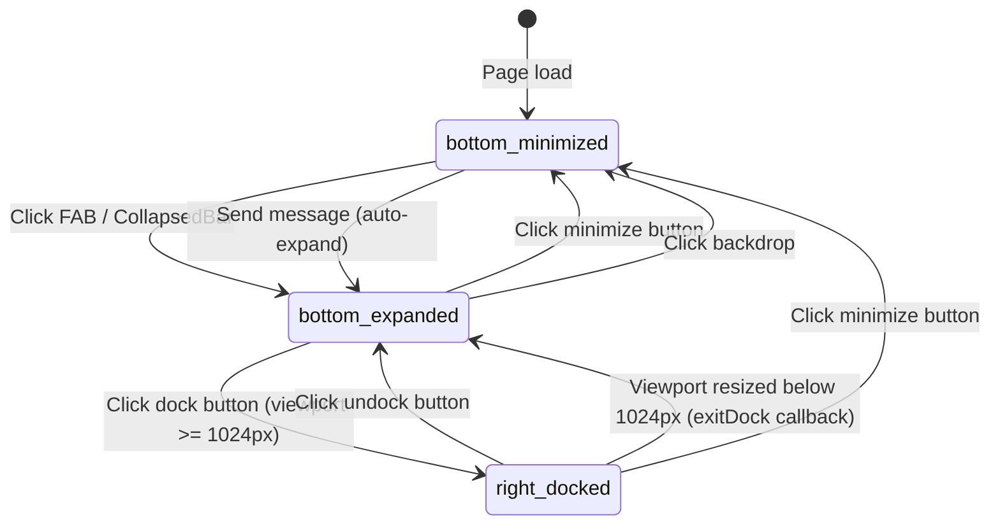
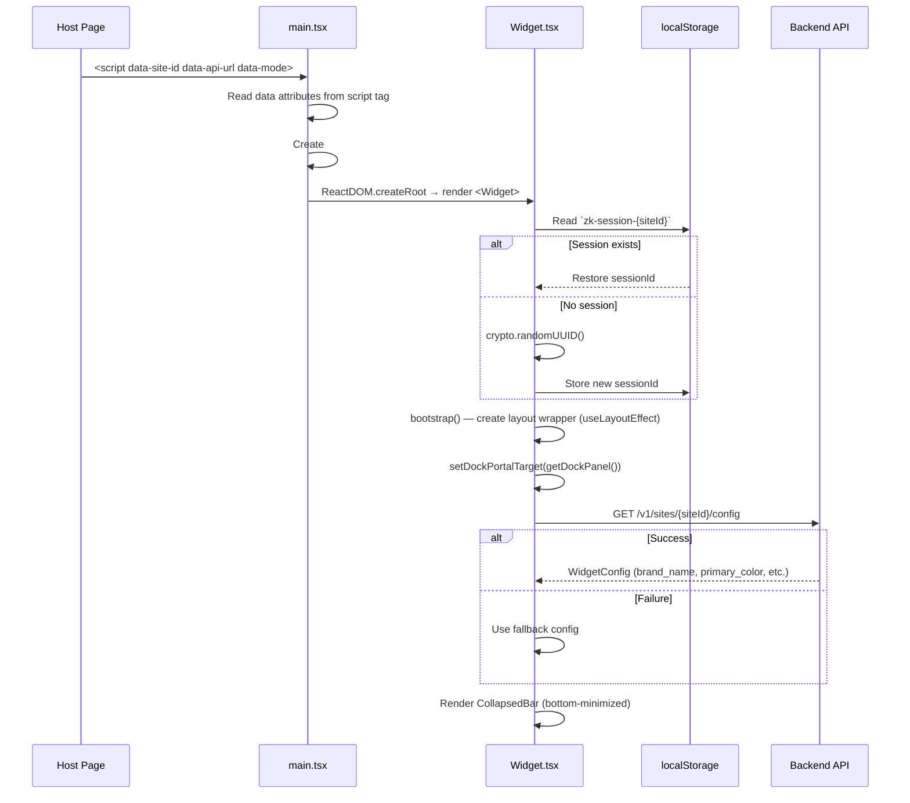
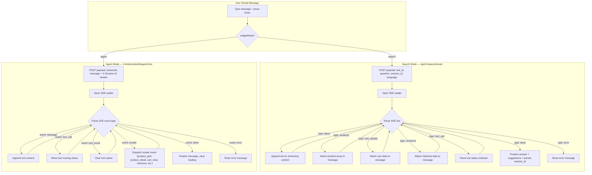
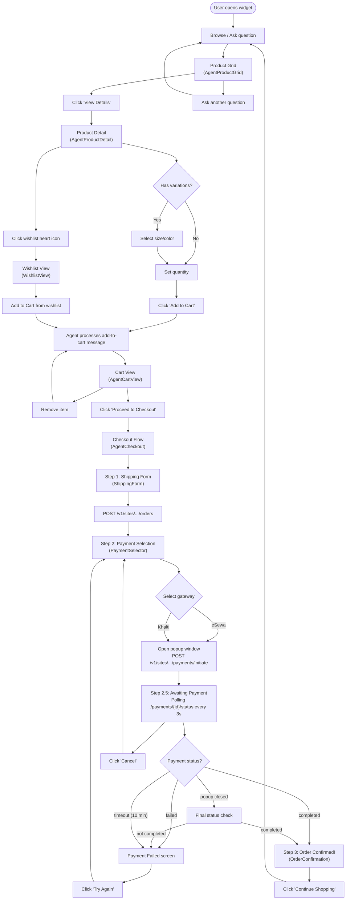
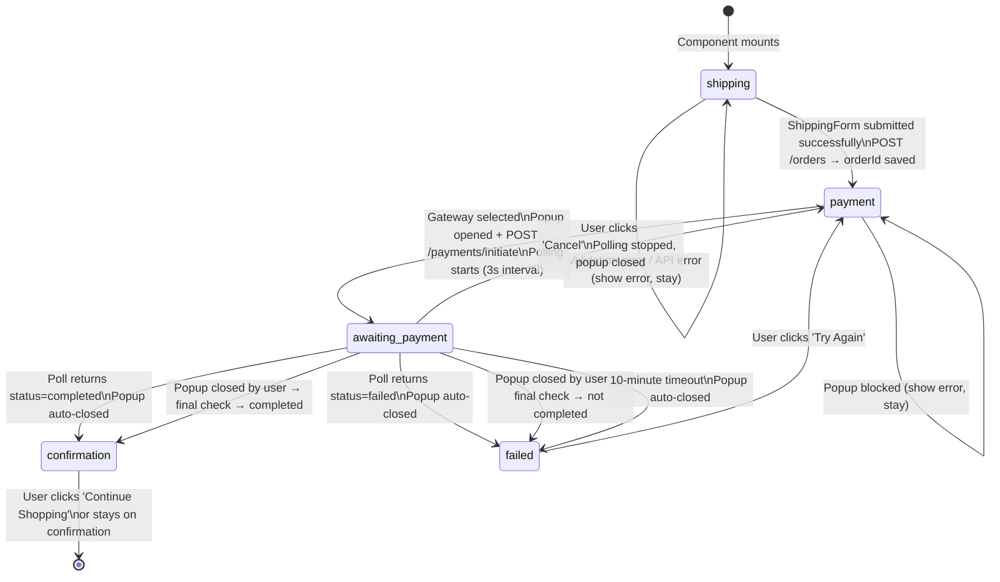
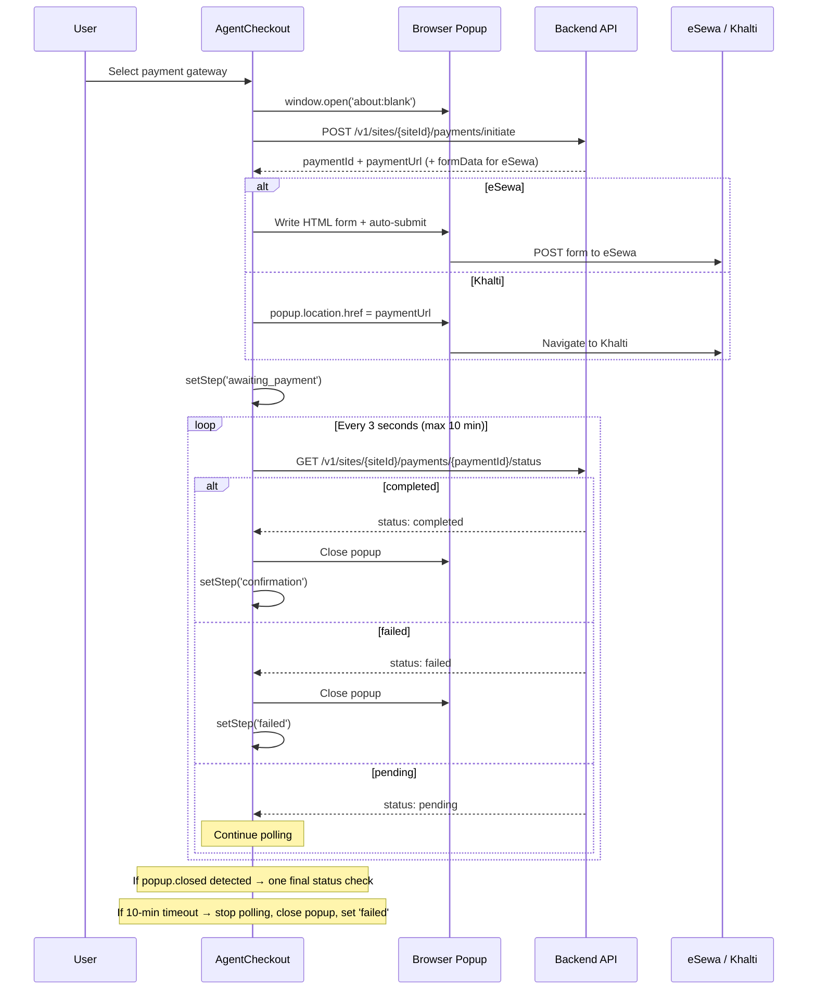
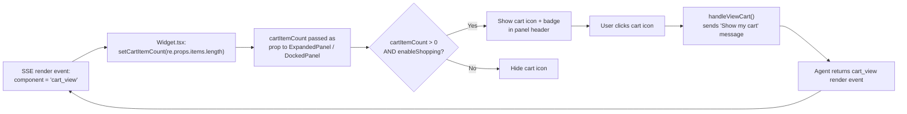
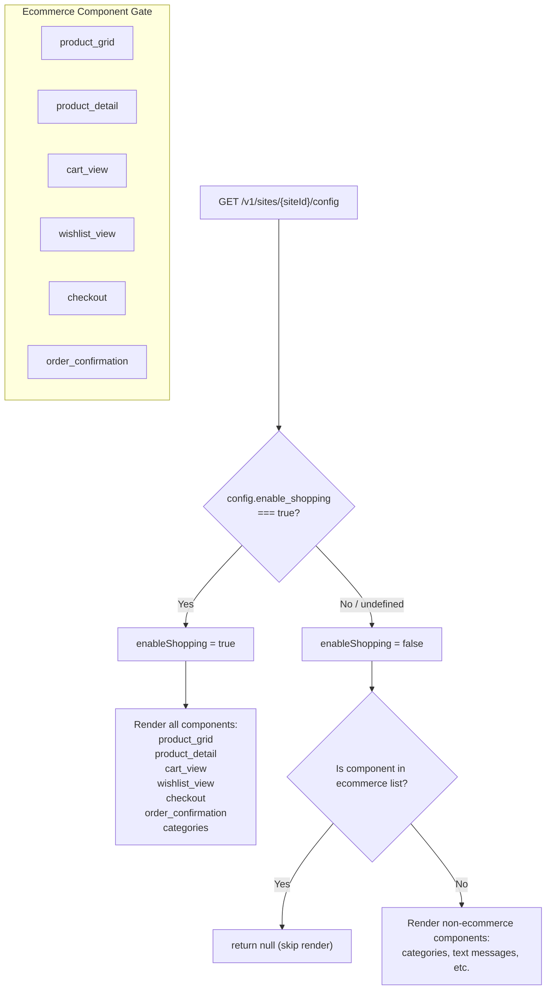

# Zunkiree Widget — End-User Flow Architecture

> Mermaid diagrams mapping the complete user journey through the Zunkiree shopping widget.
> Open in GitHub or VS Code Mermaid preview to render.

---

## 1. Widget Lifecycle — State Machine

Three top-level visual modes the widget can be in at any time.

---

## 2. Session & Config Initialization

What happens from the moment the host page loads the widget script.

---

## 3. Chat & SSE Flow

Two parallel paths depending on `widgetMode`: **search** vs **agent**.

---

## 4. Full Shopping Journey — Flowchart

The main end-to-end user flow through the ecommerce experience.

---

## 5. Checkout & Payment — Detailed State Machine

The `AgentCheckout` component's internal step transitions.

### Payment Popup & Polling Detail

---

## 6. Cart Badge Lifecycle

How the header cart icon and badge count stay in sync.

---

## 7. Ecommerce Gating

How `enable_shopping` controls which components render.

---

## Source File Reference

| File | Responsibility |
|------|---------------|
| `src/main.tsx` | Script tag bootstrap, DOM root creation |
| `src/components/Widget.tsx` | Top-level state, mode transitions, SSE handlers |
| `src/components/ExpandedPanel.tsx` | Floating panel with render event dispatch |
| `src/components/DockedPanel.tsx` | Side-docked panel (mirrors ExpandedPanel) |
| `src/components/agent/AgentCheckout.tsx` | Checkout state machine, payment popup + polling |
| `src/components/agent/AgentProductGrid.tsx` | Horizontal scrollable product cards |
| `src/components/agent/AgentProductDetail.tsx` | Product detail with variations + quantity |
| `src/components/agent/AgentCartView.tsx` | Cart item list + checkout CTA |
| `src/components/agent/OrderConfirmation.tsx` | Post-payment confirmation screen |
| `src/components/agent/PaymentSelector.tsx` | eSewa / Khalti gateway selection |
